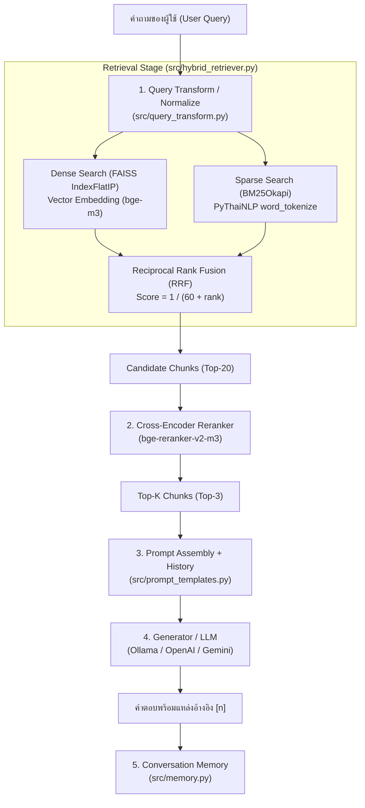

# 📚 คู่มือสรุปเนื้อหาและการเตรียมสอบ LAB04: RAG Pipeline

เอกสารนี้รวบรวมคำอธิบายสถาปัตยกรรม, การทำงานของโค้ดทุกสคริปต์ (Script-by-Script), แนวข้อสอบปรนัย (MCQ) พร้อมเฉลย และแนวทางการแก้ปัญหาทางเทคนิค (Debugging / Troubleshooting) ของ **LAB04: AI Models Question Answering System**

---

## 📑 สารบัญ
1. [ภาพรวมสถาปัตยกรรมระบบ (Architecture Overview)](#1-ภาพรวมสถาปัตยกรรมระบบ-architecture-overview)
2. [คำอธิบายโค้ดทุกสคริปต์ (Script-by-Script Breakdown)](#2-คำอธิบายโค้ดทุกสคริปต์-script-by-script-breakdown)
   - [กลุ่มที่ 1: สคริปต์หลักและไฟล์ควบคุม (Root Scripts)](#กลุ่มที่-1-สคริปต์หลักและไฟล์ควบคุม-root-scripts)
   - [กลุ่มที่ 2: สคริปต์แล็บทดลอง (Labs 01 - 07)](#กลุ่มที่-2-สคริปต์แล็บทดลอง-labs-01---07)
   - [กลุ่มที่ 3: โมดูลแกนหลักของระบบ (src/)](#กลุ่มที่-3-โมดูลแกนหลักของระบบ-src)
   - [กลุ่มที่ 4: ระบบประเมินและวัดผล (evaluation/)](#กลุ่มที่-4-ระบบประเมินและวัดผล-evaluation)
3. [เก็งแนวข้อสอบปรนัย (Multiple Choice Questions)](#3-เก็งแนวข้อสอบปรนัย-multiple-choice-questions)
4. [แนวข้อสอบการแก้ปัญหา (Troubleshooting: ปัญหานี้แก้สคริปต์ตรงไหน)](#4-แนวข้อสอบการแก้ปัญหา-troubleshooting-ปัญหานี้แก้สคริปต์ตรงไหน)
5. [สูตรและ Metrics สำคัญที่ต้องจำ (Cheat Sheet)](#5-สูตรและ-metrics-สำคัญที่ต้องจำ-cheat-sheet)

---

## 1. ภาพรวมสถาปัตยกรรมระบบ (Architecture Overview)

ระบบ RAG (Retrieval-Augmented Generation) ในแล็บนี้ผสมผสานการค้นหาแบบ **Hybrid Search (BM25 + FAISS Vector Search)** เข้ากับการจัดอันดับใหม่ (**Cross-Encoder Reranker**) และสร้างคำตอบด้วย **LLM**:

---

## 2. คำอธิบายโค้ดทุกสคริปต์ (Script-by-Script Breakdown)

### กลุ่มที่ 1: สคริปต์หลักและไฟล์ควบคุม (Root Scripts)

| ชื่อสคริปต์ | หน้าที่และการทำงาน |
| :--- | :--- |
| **`config.py`** | ศูนย์กลางตั้งค่าทั้งโปรเจกต์ มีสวิตช์เปิด/ปิดฟีเจอร์ (`USE_HYBRID`, `USE_RERANK`, `USE_LLM`, `USE_MEMORY`), กำหนดขนาด Chunk (`CHUNK_SIZE=400`, `CHUNK_OVERLAP=50`), โมเดลที่ใช้ (`bge-m3`) และ Endpoint ของ LLM |
| **`build_index.py`** | สคริปต์สร้างฐานข้อมูล Index เตรียมไว้ใช้งาน โดยรันกระบวนการ 5 ขั้น: โหลด Q&A $\rightarrow$ หั่น Chunk $\rightarrow$ คำนวณ Embedding $\rightarrow$ สร้าง FAISS Index $\rightarrow$ สร้าง BM25 Index |
| **`main.py`** | รันระบบตอบคำถามบน Terminal (CLI Interactive Mode) พิมพ์ถาม-ตอบสดผ่าน Command Line พร้อมแสดงเวลาที่ใช้ในแต่ละขั้นตอน |
| **`app.py`** | Web Server ด้วย Flask สำหรับรัน Web UI ให้บริการ API Endpoint `/api/ask` (ส่งคำถามไปเข้า RAGPipeline) และ `/api/documents` (ดึงรายการ Q&A) |

---

### กลุ่มที่ 2: สคริปต์แล็บทดลอง (Labs 01 - 07)

โฟลเดอร์ `labs/` สร้างขึ้นเพื่อให้ศึกษาขั้นตอนการทำงานของ RAG ทีละสเต็ปแบบแยกชิ้น:

1. **`lab01_extract_text.py`**: อ่านไฟล์ดิบ `ai_models_qa.txt` แปลงเป็น List of Dict และบันทึกลง `outputs/extracted_text.json`
2. **`lab02_chunking.py`**: นำข้อความ Q&A มาหั่นเป็น Chunk ย่อยตามขนาดที่กำหนด บันทึกลง `outputs/chunks.json`
3. **`lab03_create_embeddings.py`**: นำ Chunk ทั้งหมดมาแปลงเป็น Vector Embeddings (มิติ 1024) บันทึกลง `outputs/embeddings.npy`
4. **`lab04_create_vector_db.py`**: นำเวกเตอร์มาสร้าง FAISS Vector Index (`document.index`) และบันทึก Metadata (`chunk_store.json`) ลงโฟลเดอร์ `vector_db/`
5. **`lab05_query_embedding.py`**: ทดสอบแปลงประโยคคำถามตัวอย่างให้กลายเป็น Query Vector เพื่อตรวจเช็ค Dimension
6. **`lab06_similarity_search.py`**: โหลด FAISS Index แล้วทดสอบค้นหาความคล้ายคลึง (Similarity Search) ดึง Top-K Chunks
7. **`lab07_complete_retrieval.py`**: รวมสเต็ปการแปลง Query $\rightarrow$ ค้นหาใน FAISS $\rightarrow$ ดึงข้อความต้นฉบับมาแสดงผลพร้อมคะแนนความคล้ายคลึง

---

### กลุ่มที่ 3: โมดูลแกนหลักของระบบ (`src/`)

* **`document_loader.py`**: อ่านไฟล์เอกสาร ค้นหาบรรทัด `[หมวด...]`, `Q:`, `A:` สกัดออกมาเป็น Record พร้อมบันทึกเลขบรรทัดต้นฉบับ (`line_no`)
* **`text_splitter.py`**: ฟังก์ชัน `split_text()` ทำ Sliding Window หั่นข้อความโดยรักษา `overlap` และฟังก์ชัน `build_chunks()` นำ Question มารวมกับ Answer เพื่อให้ Vector มีความหมายครอบคลุมทั้งสองฝั่ง
* **`embedding_model.py`**: คลาสเรียกใช้งาน `SentenceTransformer` จุดสำคัญคือเปิด `normalize_embeddings=True` เสมอ เพื่อให้ความยาวเวกเตอร์เท่ากับ 1
* **`vector_store.py`**: ห่อหุ้ม `faiss.IndexFlatIP` (Inner Product) ใช้ค้นหาเวกเตอร์ใกล้เคียง รองรับการบันทึก (`save`) และโหลด (`load`) ไฟล์ Index
* **`hybrid_retriever.py`**: หัวใจสำคัญของการค้นหาแบบผสม:
  * ตัดคำไทยด้วย `pythainlp.tokenize.word_tokenize(..., engine="newmm")`
  * ตัดคำอังกฤษและตัวเลขด้วย Regex พร้อมแปลงเป็นตัวพิมพ์เล็ก (`.lower()`)
  * ผสมผลลัพธ์ด้วยอัลกอริทึม **Reciprocal Rank Fusion (RRF)**
* **`retriever.py`**: ตัวค้นหาแบบ Dense (Vector Search) อย่างเดียว ใช้เป็นโมเดลพื้นฐาน (Baseline)
* **`rerankers.py`**: ใช้ `CrossEncoder` (`BAAI/bge-reranker-v2-m3`) นำคู่ (Query, Chunk Text) มาคำนวณคะแนนร่วมกันเพื่อจัดอันดับความเกี่ยวข้องใหม่
* **`query_transform.py`**: ดัดแปลงคำถามก่อนส่งไปค้นหา มี 2 ระดับ:
  * ระดับ 1: `normalize_query()` แทนคำสแลงและตัดคำลงท้าย (เช่น ครับ/ค่ะ) โดยไม่ต้องใช้ AI
  * ระดับ 2: ใช้ LLM ขยายคำถาม (`rewrite`, `multi_query`, `hyde`)
* **`prompt_templates.py`**: เทมเพลต Prompt ที่สั่งให้ LLM ตอบโดยอ้างอิงเฉพาะเอกสารที่ดึงมาได้ และบังคับให้ใส่หมายเลขอ้างอิง `[1]`, `[2]`
* **`generator.py`**: สื่อสารกับ LLM (Ollama, OpenAI, Gemini) และมีคลาส `NoLLM` สำหรับทดสอบแบบตัดข้อความมาแสดงตรงๆ โดยไม่เรียก LLM จริง
* **`memory.py`**: คลาส `ConversationMemory` เก็บประวัติการสนทนา รองรับการจำกัดความยาวเพื่อไม่ให้บริบทล้น และมีฟังก์ชัน `is_followup()` ตรวจว่าคำถามล่าสุดจำเป็นต้องใช้บริบทเก่าหรือไม่
* **`rag_pipeline.py`**: คลาสศูนย์กลางที่เชื่อมต่อทุกส่วนเข้าด้วยกันตั้งแต่รับคำถาม $\rightarrow$ ปรับแต่งคำถาม $\rightarrow$ ค้นหา $\rightarrow$ จัดอันดับใหม่ $\rightarrow$ ประกอบ Prompt $\rightarrow$ ส่งให้ LLM สร้างคำตอบ
* **`index_meta.py`**: เก็บ Metadata ของ Index (จำนวน Chunk, ชื่อโมเดล) เพื่อตรวจสอบความเข้ากันได้

---

### กลุ่มที่ 4: ระบบประเมินและวัดผล (`evaluation/`)

* **`build_golden_set.py`**: สร้างชุดข้อสอบประเมิน `golden_set.json` อัตโนมัติ โดยสร้างคำถามออกมา 4 รูปแบบ:
  * `verbatim`: คำถามตรงตัวตามเอกสาร (วัด Upper Bound)
  * `slang`: คำถามภาษาพูด/คำสแลง
  * `partial`: คำค้นสั้นๆ แบบ Keyword
  * `natural`: คำถามธรรมชาติที่ผู้ใช้จริงมักจะพิมพ์
* **`metrics.py`**: คำนวณค่าทางสถิติ Information Retrieval:
  * `Hit@k`: มีเอกสารที่ถูกต้องติดใน Top-K หรือไม่ (0 หรือ 1)
  * `Recall@k`: สัดส่วนเอกสารที่ถูกต้องที่ดึงมาได้เทียบกับเอกสารที่ถูกต้องทั้งหมด
  * `Precision@k`: สัดส่วนเอกสารที่ถูกต้องเทียบกับจำนวนที่ดึงมา ($k$)
  * `MRR (Mean Reciprocal Rank)`: ส่วนกลับของอันดับเอกสารที่ถูกต้องชิ้นแรก ($1/\text{rank}$)
  * `nDCG@k`: คุณภาพการจัดอันดับโดยคิดค่าน้ำหนักลดหลั่นตามตำแหน่ง ($\frac{1}{\log_2(\text{rank}+1)}$)
* **`eval_retrieval.py`**: นำชุดข้อสอบมารันทดสอบเปรียบเทียบ 4 รูปแบบ: `dense_only` vs `bm25_only` vs `hybrid` vs `hybrid+rerank`
* **`eval_generation.py`**: ประเมินคุณภาพคำตอบของ LLM ในแง่:
  * `faithfulness`: สัดส่วนคำตอบที่สอดคล้องกับเอกสาร (เช็คว่ามี Hallucination หรือไม่)
  * `correctness`: สัดส่วนคำตอบที่ตรงกับคำตอบมาตรฐาน (Reference Answer)
  * `relevance`: ความตรงประเด็นกับคำถาม
  * `refused`: ตรวจว่าระบบปฏิเสธตอบเมื่อไม่มีข้อมูลหรือไม่

---

## 3. เก็งแนวข้อสอบปรนัย (Multiple Choice Questions)

### ข้อที่ 1 (FAISS & Similarity)
**โจทย์:** ใน `vector_store.py` การใช้ `faiss.IndexFlatIP` (Inner Product) จะให้ผลลัพธ์เทียบเท่ากับ Cosine Similarity ก็ต่อเมื่อเงื่อนไขใดเป็นจริง?
- ก. ขนาดของเวกเตอร์ต้องเท่ากับ 768 มิติ
- ข. เวกเตอร์ทั้งหมดต้องผ่านการ Normalize ให้มีความยาวเป็น 1 หน่วย (`normalize_embeddings=True`) ✅ *(เฉลย)*
- ค. ต้องเปิดใช้งาน BM25 ร่วมด้วย
- ง. ข้อมูลคำถามและคำตอบต้องอยู่ในบรรทัดเดียวกัน

---

### ข้อที่ 2 (Hybrid Search & RRF)
**โจทย์:** สูตร Reciprocal Rank Fusion (RRF) ใน `hybrid_retriever.py` คือ $\text{Score} = \sum \frac{1}{k + \text{rank}}$ ทำไมต้องนำ "อันดับ (Rank)" มาคำนวณ แทนที่จะใช้คะแนนจริง (Raw Score)?
- ก. เพราะคะแนนของ Dense (0 ถึง 1) และ BM25 (0 ถึง 30+) มีสเกลที่ต่างกันมาก นำมาบวกกันตรงๆ ไม่ได้ ✅ *(เฉลย)*
- ข. เพราะ FAISS ไม่อนุญาตให้ดึงคะแนนจริงออกมา
- ค. เพื่อลดขนาด Memory ของระบบลงครึ่งหนึ่ง
- ง. เพราะ BM25 ให้คะแนนเป็นเลขจำนวนเต็มเท่านั้น

---

### ข้อที่ 3 (Bi-Encoder vs Cross-Encoder)
**โจทย์:** เพราะเหตุใดในขั้นตอนการค้นหาเอกสาร จึงต้องใช้ Bi-Encoder ดึงเอกสารออกมาก่อน (Top-20) แล้วจึงใช้ Cross-Encoder มาทำ Rerank ให้เหลือ Top-3?
- ก. เพราะ Cross-Encoder ไม่สามารถคำนวณและทำ Index เวกเตอร์ล่วงหน้าได้ ทำให้มีความเร็วช้ามากหากต้องค้นหาเอกสารทั้งหมด ✅ *(เฉลย)*
- ข. เพราะ Cross-Encoder แม่นยำน้อยกว่า Bi-Encoder
- ค. เพราะ Bi-Encoder มีขนาดโมเดลที่ใหญ่กว่า Cross-Encoder
- ง. เพราะ Cross-Encoder ไม่รองรับภาษาไทย

---

### ข้อที่ 4 (Information Retrieval Metrics)
**โจทย์:** หากระบบค้นหาคืน ID ของเอกสารมาเป็น `[12, 5, 88, 3]` และเอกสารเฉลยที่ถูกต้องคือ `[5]` ค่า **Hit@1**, **Hit@2** และ **MRR** มีค่าเท่าใด?
- ก. Hit@1 = 1, Hit@2 = 1, MRR = 1.0
- ข. Hit@1 = 0, Hit@2 = 1, MRR = 0.5 ✅ *(เฉลย)*
- ค. Hit@1 = 0, Hit@2 = 0, MRR = 0.25
- ง. Hit@1 = 1, Hit@2 = 0, MRR = 0.5
*(วิธีคิด: เอกสาร 5 อยู่ในอันดับที่ 2 ดังนั้น Hit@1 = 0, Hit@2 = 1 และ MRR = 1/2 = 0.5)*

---

### ข้อที่ 5 (Chunking & Overlap)
**โจทย์:** วัตถุประสงค์หลักของการกำหนดค่า `CHUNK_OVERLAP = 50` ใน `config.py` คืออะไร?
- ก. เพื่อเพิ่มจำนวนข้อความให้ Vector DB มีขนาดใหญ่ขึ้น
- ข. ป้องกันไม่ให้ใจความสำคัญขาดตอนบริเวณรอยต่อระหว่างชิ้นข้อความ ✅ *(เฉลย)*
- ค. เพื่อให้โมเดลประมวลผลคำตอบได้เร็วขึ้น
- ง. เพื่อลดการใช้หน่วยความจำ RAM

---

## 4. แนวข้อสอบการแก้ปัญหา (Troubleshooting: ปัญหานี้แก้สคริปต์ตรงไหน)

### ปัญหาที่ 1: เปลี่ยนชื่อโมเดล Embedding แล้วระบบแจ้ง Dimension Mismatch
* **อาการ:** เปลี่ยน `EMBEDDING_MODEL_NAME` ใน `config.py` แล้วเกิด Error ใน FAISS
* **สาเหตุ:** เวกเตอร์เดิมที่สร้างไว้ใน `vector_db/document.index` มีมิติไม่ตรงกับโมเดลใหม่
* **วิธีแก้:** ต้องรันสคริปต์ `build_index.py` ใหม่เสมอ (`python build_index.py`) เพื่อสร้าง Index ใหม่ให้ตรงกับโมเดล

---

### ปัญหาที่ 2: การค้นหาด้วยคำภาษาไทยใน BM25 ได้ผลลัพธ์แย่มาก
* **อาการ:** ค้นหาคำศัพท์ภาษาไทยไม่เจอ หรือจับคู่ผิดพลาด
* **ไฟล์ที่ต้องเข้าไปตรวจสอบ:** `src/hybrid_retriever.py`
* **จุดที่ต้องแก้:** ฟังก์ชัน `tokenize_thai()` ตรวจสอบว่าได้ติดตั้งและเรียกใช้งาน `pythainlp.tokenize.word_tokenize(text, engine="newmm")` หรือไม่ เพราะหากไม่ได้ติดตั้ง ระบบจะตกไปใช้วิธีสำรองตัดทีละ 3 ตัวอักษร (`n-gram`) ซึ่งทำให้ความแม่นยำต่ำลงอย่างมาก

---

### ปัญหาที่ 3: บอทจำบริบทบทสนทนาก่อนหน้าไม่ได้ (Multi-turn Fail)
* **อาการ:** พอถามคำถามต่อเนื่อง เช่น "แล้วรุ่นนี้ราคาเท่าไหร่" บอทไม่รู้ว่า "รุ่นนี้" หมายถึงโมเดลใด
* **จุดที่ต้องตรวจสอบและแก้ไข:**
  1. ไฟล์ `config.py`: เปิด `USE_MEMORY = True`
  2. ไฟล์ `src/memory.py`: ตรวจสอบว่าโควตาบทสนทนา (`MEMORY_MAX_TURNS`) น้อยเกินไปจนถูกลบทิ้งหรือไม่
  3. ไฟล์ `src/query_transform.py`: เปิดฟังก์ชัน Query Rewriting เพื่อเปลี่ยนคำถามกำกวมให้กลายเป็นคำถามที่สมบูรณ์ก่อนนำไปค้นหา

---

### ปัญหาที่ 4: LLM ตอบมั่ว แต่งคำตอบขึ้นมาเอง (Hallucination)
* **อาการ:** คำถามที่ไม่มีในเอกสาร แต่บอทแต่งเรื่องขึ้นมาตอบ
* **จุดที่ต้องแก้ไข:**
  1. ไฟล์ `src/prompt_templates.py`: ปรับปรุง System Prompt โดยกำชับว่า *"หากข้อมูลที่ให้มาไม่เพียงพอ ให้ตอบว่า 'ไม่พบข้อมูล' ห้ามคาดเดาหรือสร้างข้อมูลขึ้นมาเอง"*
  2. ไฟล์ `config.py`: ปรับลดค่า `LLM_TEMPERATURE` ให้ต่ำลง (เช่น `0.0` ถึง `0.2`) เพื่อลดความสุ่ม

---

## 5. สูตรและ Metrics สำคัญที่ต้องจำ (Cheat Sheet)

| หัวข้อ | สูตร / สมการ | คำอธิบาย |
| :--- | :--- | :--- |
| **Cosine Similarity** | $\cos(\theta) = \frac{\mathbf{A} \cdot \mathbf{B}}{\|\mathbf{A}\| \|\mathbf{B}\|}$ | หาก $\|\mathbf{A}\| = \|\mathbf{B}\| = 1$ จะเหลือเพียง $\mathbf{A} \cdot \mathbf{B}$ (Inner Product) |
| **RRF Score** | $\text{RRF}(d) = \sum_{m \in M} \frac{1}{k + r_m(d)}$ | $k=60$, $r_m(d)$ คืออันดับของเอกสาร $d$ ในระบบค้นหา $m$ |
| **Hit@k** | $1 \text{ if } (\text{Relevant} \cap \text{Top}_k) \neq \emptyset \text{ else } 0$ | ติด 1 ใน $k$ อันดับแรกหรือไม่ |
| **MRR** | $\text{MRR} = \frac{1}{\text{rank}_{\text{first\_hit}}}$ | ส่วนกลับของอันดับเอกสารที่ถูกต้องตัวแรก |
| **nDCG@k** | $\text{nDCG}_k = \frac{\text{DCG}_k}{\text{IDCG}_k}$ | $\text{DCG}_k = \sum_{i=1}^k \frac{2^{rel_i} - 1}{\log_2(i + 1)}$ |
| **Faithfulness** | $\frac{|\text{Tokens}(\text{Answer}) \cap \text{Tokens}(\text{Context})|}{|\text{Tokens}(\text{Answer})|}$ | วัดว่าคำตอบยึดตามข้อความในเอกสารอ้างอิงแค่ไหน |
