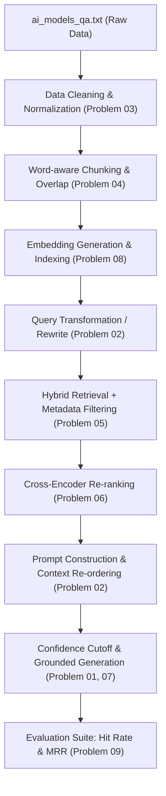

# ⚡ LAB05: RAG System Development II & Common Failure Modes Analysis

ระบบวิเคราะห์และจำลอง 9 ปัญหาสำคัญในการพัฒนาระบบ **RAG (Retrieval-Augmented Generation)** และ **LLM** โดยเปรียบเทียบจุดบกพร่องของโค้ดใน **LAB04** และแนวทางการแก้ไขอย่างเป็นรูปธรรม ด้วยชุดข้อมูลคลังความรู้จริง `ai_models_qa.txt`

---

### 👨‍💻 สมาชิกผู้จัดทำ (Author)
* **ชื่อ-นามสกุล (Name):** นายรัชชานนท์ ศรีไชย
* **รหัสนักศึกษา (Student ID):** 116730462005-3

---

## 📖 บทนำและวัตถุประสงค์ (Overview & Objectives)

โปรเจกต์นี้เป็นการต่อยอดจาก **LAB04 (AI Models Q&A System)** โดยนำ Pipeline การทำงานมาวิเคราะห์เชิงลึกเกี่ยวกับ **ข้อผิดพลาด คอขวด และจุดล้มเหลว (Failure Modes & Bottlenecks)** ที่พบบ่อยในการพัฒนาและปรับแต่งระบบ RAG ให้มีความพร้อมสำหรับระดับ Production 

โดยทดสอบบนชุดข้อมูลคลังความรู้จริง [ai_models_qa.txt](file:///h:/Advance%20LLM/ATCS-CPE/LAB05/ai_models_qa.txt) (ชุดข้อมูลถาม-ตอบโมเดล AI) เพื่อเปรียบเทียบให้เห็นชัดเจนว่า **โค้ดเดิมของ LAB04 มีปัญหาตรงจุดใด** และ **ต้องแก้ไขอย่างไรจึงจะทำงานได้อย่างถูกต้องและแม่นยำ**



---

## 📁 โครงสร้างโปรเจกต์ (Project Structure)

```text
LAB05/
├── README.md                      # 📄 รายงานสรุปและคู่มือการวิเคราะห์ปัญหา RAG จาก LAB04
├── ai_models_qa.txt               # 📚 คลังข้อมูลความรู้จริง (AI Models Q&A Knowledge Base)
├── data_loader.py                 # 🔄 ตัวโหลดและแปลงข้อมูล ai_models_qa.txt -> list of dict
├── main.py                        # 💻 สคริปต์เมนูหลักสำหรับเลือกรันและทดสอบปัญหา 1-9
├── problem01_hallucination.py     # 🛑 ปัญหาที่ 1: ภาพหลอน (Hallucination / ขาด Confidence Threshold)
├── problem02_transformer.py       # 🔤 ปัญหาที่ 2: คำไม่ตรงกัน (Vocabulary Mismatch) + Lost in the Middle
├── problem03_data_quality.py      # 🧹 ปัญหาที่ 3: คุณภาพข้อมูล (Noise / Deduplication / Normalization)
├── problem04_chunking.py          # ✂️ ปัญหาที่ 4: การหั่นข้อความ (Naive Character Cut vs Word-aware)
├── problem05_metadata.py          # 🏷️ ปัญหาที่ 5: การขาดการกรองด้วยหมวดหมู่ (Metadata Filtering)
├── problem06_reranking.py         # 🎯 ปัญหาที่ 6: อันดับตก (First-Stage Bi-encoder vs Cross-Encoder Re-ranking)
├── problem07_generation.py        # ⚠️ ปัญหาที่ 7: ค้นหาเอกสารเจอถูก แต่สร้างคำตอบบิดเบือน (Faithfulness)
├── problem08_config.py            # ⚙️ ปัญหาที่ 8: การปรับคอนฟิกและการเกิด Index Desynchronization Drift
└── problem09_evaluation.py        # 📊 ปัญหาที่ 9: การประเมินผลเชิงปริมาณ (Hit Rate @ K, MRR)
```

---

## 🔬 รายละเอียด 9 ปัญหาจากโค้ด LAB04 และแนวทางการแก้ไข (Detailed LAB04 Analysis & Fixes)

### 1. Problem 01: Hallucination & Context Deficiency (`problem01_hallucination.py`)
* **จุดบกพร่องในโค้ด LAB04:**
  * ใน [generator.py](file:///h:/Advance%20LLM/ATCS-CPE/LAB04/04-RAG-Project/src/generator.py#L79-L84) มีการตรวจสอบเฉพาะกรณี `if not chunks:` เท่านั้น
  * เมื่อผู้ใช้ถามคำถามนอกเรื่อง (Out-of-domain) เช่น *"ตั๋วเครื่องบินไปเชียงใหม่ราคาเท่าไหร่"* หรือคำถามที่มีคำว่า *"ราคา"* ปะปนอยู่ Retriever จะดึง Chunk ค่าบริการ AI ที่มีคะแนนความคล้ายต่ำมากส่งไปให้ LLM ทำให้โมเดลพยายามแถตอบจนเกิด **Hallucination**
  * ในบรรทัด 92-93 หากเรียก LLM ไม่สำเร็จ โค้ดจะ Fallback เป็น `answer = chunks[0]["answer"]` ซึ่งจะส่งคำตอบที่ไม่ตรงกับคำถามเลยให้ผู้ใช้
* **แนวทางแก้ไขสำหรับ LAB04:**
  * กำหนดค่า `SIMILARITY_THRESHOLD` (เช่น 0.40) ใน [config.py](file:///h:/Advance%20LLM/ATCS-CPE/LAB04/04-RAG-Project/config.py)
  * ใน [generator.py](file:///h:/Advance%20LLM/ATCS-CPE/LAB04/04-RAG-Project/src/generator.py) ให้ตรวจสอบคะแนน Chunk สูงสุด หากคะแนนต่ำกว่า Threshold ให้ถือว่า `no_context = True` และตอบปฏิเสธด้วย `NO_CONTEXT_MESSAGE` ทันที

---

### 2. Problem 02: Vocabulary Mismatch & Token Position (`problem02_transformer.py`)
* **จุดบกพร่องในโค้ด LAB04:**
  * **Vocabulary Mismatch:** ใน [config.py](file:///h:/Advance%20LLM/ATCS-CPE/LAB04/04-RAG-Project/config.py#L20) ตั้งค่า `USE_QUERY_TRANSFORM = False` เป็นค่าเริ่มต้น เมื่อผู้ใช้พิมพ์ภาษาพูด/สแลง เช่น *"แนะนำ AI เขียนโปรแกรม ตัวไหนไวและถูกสุด"* ระบบ BM25 จะตัดคำแล้วไม่ตรงกับศัพท์ทางการในเอกสาร (`"เขียนโค้ด"`, `"Haiku"`, `"เร็วและประหยัดที่สุด"`) ทำให้ค้นหาไม่เจอ
  * **Lost in the Middle:** ใน [prompt_templates.py](file:///h:/Advance%20LLM/ATCS-CPE/LAB04/04-RAG-Project/src/prompt_templates.py#L29-L44) ฟังก์ชัน `format_context()` เรียง Chunk เป็น `[1], [2], [3]` หากข้อมูลสำคัญอยู่ตรงกลาง โมเดล Transformer มักจะละเลยเนื้อหาตรงกลางเนื่องจากกลไก Attention ให้อิทธิพลกับหัวและท้าย Prompt มากกว่า
* **แนวทางแก้ไขสำหรับ LAB04:**
  * เปิด `USE_QUERY_TRANSFORM = True` ใน [config.py](file:///h:/Advance%20LLM/ATCS-CPE/LAB04/04-RAG-Project/config.py) เพื่อใช้โมดูล Query Expansion / Rewrite ใน [query_transform.py](file:///h:/Advance%20LLM/ATCS-CPE/LAB04/04-RAG-Project/src/query_transform.py)
  * ปรับแต่ง `format_context()` ให้สลับตำแหน่งนำ Chunk ที่มีคะแนนสูงสุดไปวางชิดกับคำถามของผู้ใช้ (Context Re-ordering)

---

### 3. Problem 03: Data Quality, Noise & Redundancy (`problem03_data_quality.py`)
* **จุดบกพร่องในโค้ด LAB04:**
  * ใน [document_loader.py](file:///h:/Advance%20LLM/ATCS-CPE/LAB04/04-RAG-Project/src/document_loader.py#L26) อ่านข้อมูลด้วย `line = raw.strip()` โดย**ไม่มีการทำ Text Normalization** ทำให้ปัญหาสระลอย, วรรณยุกต์ซ้อน, หรือช่องว่างไม่มาตรฐาน บิดเบือนเวกเตอร์ของ `bge-m3`
  * ขาดระบบตรวจจับและตัดข้อมูลซ้ำซ้อน (Deduplication) หากข้อมูลมีคำถามหรือเนื้อหาซ้ำ จะถูกดึงเข้ามาแย่งโควตา Top-K พร้อมกันทั้งหมด ทำให้สูญเสียพื้นที่ Context Window ไปโดยเปล่าประโยชน์
* **แนวทางแก้ไขสำหรับ LAB04:**
  * เพิ่มฟังก์ชัน Clean & Normalize โดยใช้ `pythainlp.util.normalize` และ Regex ทำความสะอาดอักขระขยะใน [document_loader.py](file:///h:/Advance%20LLM/ATCS-CPE/LAB04/04-RAG-Project/src/document_loader.py)
  * ใช้ Hash-based Deduplication ใน [build_index.py](file:///h:/Advance%20LLM/ATCS-CPE/LAB04/04-RAG-Project/build_index.py) เพื่อกรองข้อความซ้ำก่อนสร้าง FAISS Vector Index

---

### 4. Problem 04: Chunking Strategy - Naive Character Slicing (`problem04_chunking.py`)
* **จุดบกพร่องในโค้ด LAB04:**
  * ใน [text_splitter.py](file:///h:/Advance%20LLM/ATCS-CPE/LAB04/04-RAG-Project/src/text_splitter.py#L21-L29) ฟังก์ชัน `split_text()` สไลซ์ข้อความตามจำนวนตัวอักษรดิบๆ:
    ```python
    chunks.append(text[start:start + chunk_size])
    start += chunk_size - overlap
    ```
  * ในภาษาไทยซึ่งไม่มีการเว้นวรรคระหว่างคำ การตัดแบบนี้ส่งผลให้ **"คำศัพท์ถูกตัดขาดครึ่งคำ"** ตรงรอยต่อ เช่น `"ปัญ|ญาประดิษฐ์"`, `"ประสิทธิ|ภาพ"` ทำให้ทั้งการสร้างเวกเตอร์และการตัดคำของ BM25 เสียหายทันที
* **แนวทางแก้ไขสำหรับ LAB04:**
  * ปรับปรุง [text_splitter.py](file:///h:/Advance%20LLM/ATCS-CPE/LAB04/04-RAG-Project/src/text_splitter.py) ให้ใช้ **Word-aware Chunking** โดยใช้ `pythainlp.tokenize.word_tokenize` หรือตัดตามขอบเขตของประโยค เพื่อรักษาคำศัพท์ให้คงรูปสมบูรณ์เสมอ
  * รักษาสัดส่วน Overlap 10-15% (เช่น `CHUNK_SIZE = 400`, `CHUNK_OVERLAP = 50`) เพื่อเชื่อมโยงบริบทข้ามชิ้น

---

### 5. Problem 05: Missing Metadata Filtering (`problem05_metadata.py`)
* **จุดบกพร่องในโค้ด LAB04:**
  * แม้ใน [document_loader.py](file:///h:/Advance%20LLM/ATCS-CPE/LAB04/04-RAG-Project/src/document_loader.py) จะดึงค่า `category` เก็บไว้ใน `chunk_store.json`
  * แต่ใน [hybrid_retriever.py](file:///h:/Advance%20LLM/ATCS-CPE/LAB04/04-RAG-Project/src/hybrid_retriever.py#L149) ฟังก์ชัน `retrieve()` และ `dense_search()` **ไม่มี Parameter สำหรับกรองข้อมูลด้วย Metadata เลย**
  * เมื่อผู้ใช้ต้องการถามเรื่องราคาเฉพาะหมวด แต่คำถามมีคีย์เวิร์ดทั่วไป ("โมเดล", "AI") ระบบจะดึงข้อมูลจากหมวดอื่นเข้ามาติด Top-K แทนที่จะเป็นหมวดราคา
* **แนวทางแก้ไขสำหรับ LAB04:**
  * เพิ่มพารามิเตอร์ `category_filter=None` ในฟังก์ชัน `retrieve()` ของ [hybrid_retriever.py](file:///h:/Advance%20LLM/ATCS-CPE/LAB04/04-RAG-Project/src/hybrid_retriever.py)
  * ทำ Pre-filtering หรือ Post-filtering กรองเฉพาะ Chunks ที่มี `category` ตรงกับที่ผู้ใช้ระบุหรือสกัดได้จากคำถาม

---

### 6. Problem 06: Top-K Selection & Cross-Encoder Re-ranking (`problem06_reranking.py`)
* **จุดบกพร่องในโค้ด LAB04:**
  * ใน [config.py](file:///h:/Advance%20LLM/ATCS-CPE/LAB04/04-RAG-Project/config.py#L19) ตั้งค่า `USE_RERANK = False` เป็นค่าเริ่มต้นเพื่อเน้นความเร็วในการตอบกลับผ่านเว็บ
  * การค้นหาขั้นแรก (First-stage Retrieval) ด้วย Bi-encoder และ BM25 จะให้น้ำหนักกับคำกว้างๆ (Generic terms) เท่าๆ กับคำเฉพาะทาง ส่งผลให้เอกสารที่มีคำตอบเจาะจงลึกๆ (เช่น สเปกโมเดล Mythos หรือ Fable) หลุดไปอยู่อันดับ 5-8
  * เมื่อระบบตัดส่ง LLM เฉพาะ `TOP_K = 3` ข้อมูลสำคัญจึงหลุดโผ ทำให้ตอบคำถามเจาะจงไม่ได้
* **แนวทางแก้ไขสำหรับ LAB04:**
  * เปิด `USE_RERANK = True` ใน [config.py](file:///h:/Advance%20LLM/ATCS-CPE/LAB04/04-RAG-Project/config.py)
  * ปรับสถาปัตยกรรมเป็น Two-Stage Retrieval: ดึงผู้เข้ารอบ `CANDIDATE_K = 20` แล้วส่งให้ Cross-Encoder (`BAAI/bge-reranker-v2-m3` ใน [rerankers.py](file:///h:/Advance%20LLM/ATCS-CPE/LAB04/04-RAG-Project/src/rerankers.py)) คำนวณความสัมพันธ์เชิงลึกเพื่อดันคำตอบที่แท้จริงขึ้นสู่อันดับ 1-3

---

### 7. Problem 07: Generation Failure despite Correct Retrieval (`problem07_generation.py`)
* **จุดบกพร่องในโค้ด LAB04:**
  * ค่าเริ่มต้นของ LAB04 คือ `USE_LLM = False` ซึ่งจะใช้คลาส [NoLLM](file:///h:/Advance%20LLM/ATCS-CPE/LAB04/04-RAG-Project/src/generator.py#L42-L58) ทำหน้าที่เพียงแค่ตัดข้อความท่อนแรกมาแสดง โดยไม่สามารถสังเคราะห์หรือวิเคราะห์คำตอบได้
  * เมื่อเปิด `USE_LLM = True` หากตั้งค่า Temperature สูง หรือ System Prompt ไม่รัดกุม LLM อาจดัดแปลงตัวเลขสเปก เช่น เปลี่ยนบริบทตัวเลข *"1 ล้านโทเคน"* หรือ *"20 ดอลลาร์สหรัฐ"* ให้ผิดเพี้ยน (Faithfulness Failure)
* **แนวทางแก้ไขสำหรับ LAB04:**
  * กำหนดค่า `LLM_TEMPERATURE = 0.0` หรือ `0.1` ใน [config.py](file:///h:/Advance%20LLM/ATCS-CPE/LAB04/04-RAG-Project/config.py) สำหรับงานตอบคำถามเชิงข้อเท็จจริง
  * เสริมคำสั่งใน [prompt_templates.py](file:///h:/Advance%20LLM/ATCS-CPE/LAB04/04-RAG-Project/src/prompt_templates.py) ให้ห้ามแก้ไขตัวเลข รหัสรุ่น หรือเงื่อนไขเวลาโดยเด็ดขาด พร้อมอ้างอิง `[n]` ให้ตรวจสอบได้

---

### 8. Problem 08: RAG Configuration & Index Desynchronization (`problem08_config.py`)
* **จุดบกพร่องในโค้ด LAB04:**
  * ค่าคอนฟิกใน [config.py](file:///h:/Advance%20LLM/ATCS-CPE/LAB04/04-RAG-Project/config.py) เป็นการสลับเปิด/ปิดแบบตายตัว และไม่มีการวัดผลเปรียบเทียบ Profile ชัดเจน
  * **ปัญหา Index Drift / Desynchronization:** หากผู้ใช้แก้ไขค่า `CHUNK_SIZE`, `CHUNK_OVERLAP` หรือ `EMBEDDING_MODEL_NAME` ใน `config.py` แต่ลืมรัน `python build_index.py` ระบบจะทำงานบน Index เก่าที่สร้างไว้ ทำให้ Chunk ID และข้อความไม่ตรงกันโดยไม่มีการเตือนใดๆ
* **แนวทางแก้ไขสำหรับ LAB04:**
  * จัดกลุ่ม Configuration เป็น Profile ชัดเจน (Fast Web Mode vs High-Accuracy Enterprise Mode)
  * เพิ่มการบันทึกแฮชของ Configuration ลงใน [index_meta.py](file:///h:/Advance%20LLM/ATCS-CPE/LAB04/04-RAG-Project/src/index_meta.py) เพื่อตรวจสอบว่าค่าคอนฟิกเปลี่ยนไปหรือไม่ก่อนเริ่มรัน หากเปลี่ยนให้แจ้งเตือนให้รัน build_index ใหม่

---

### 9. Problem 09: RAG Evaluation Suite (`problem09_evaluation.py`)
* **จุดบกพร่องในโค้ด LAB04:**
  * ใน LAB04 การประเมินผลแยกเป็นไฟล์เดี่ยวใน `evaluation/` ซึ่งมักไม่ได้รันในการพัฒนาประจำวัน ทำให้นักพัฒนาไม่ทราบคะแนนเชิงปริมาณที่แท้จริง
  * ขาดตัวชี้วัด Ranking สำคัญ เช่น **MRR (Mean Reciprocal Rank)** และ **Hit Rate @ K (K=1, 3, 5, 10)** ทำให้ไม่เห็นว่าเอกสารคำตอบหลุดโผ Top-3 ไปอยู่อันดับที่เท่าใด
* **แนวทางแก้ไขสำหรับ LAB04:**
  * รวมสคริปต์ประเมินผลอัตโนมัติ วัดค่า Hit Rate@K และ MRR บนชุดทดสอบจริงจาก `ai_models_qa.txt` ทุกครั้งที่มีการแก้ไขโมเดลหรือขนาด Chunk
  * ใช้ตัวเลข MRR และ Hit Rate@3 เป็นเกณฑ์ตัดสินใจหลักในการเปิดใช้งาน Reranker

---

## 📊 ตารางสรุปการเปรียบเทียบข้อผิดพลาด (LAB04 vs LAB05 Solved)

| หมายเลขปัญหา | ชื่อปัญหา (Problem Name) | จุดบกพร่องในโค้ด LAB04 | แนวทางแก้ไขใน LAB05 / โค้ดที่แก้ไข |
| :---: | :--- | :--- | :--- |
| **01** | **Hallucination** | `generator.py`: ขาด Confidence Cutoff ส่ง Chunk คะแนนต่ำให้ LLM แถตอบ | เพิ่ม `SIMILARITY_THRESHOLD = 0.40` ปฏิเสธการตอบเมื่อคะแนนต่ำ |
| **02** | **Vocab Mismatch & Position** | `config.py`: ปิด `USE_QUERY_TRANSFORM`, Context เรียงตรงๆ เสี่ยง Lost in Middle | เปิด Query Rewrite และทำ Context Re-ordering วาง Chunk สำคัญชิดคำถาม |
| **03** | **Data Quality** | `document_loader.py`: ขาด Normalization & Deduplication | เพิ่ม PyThaiNLP `normalize()` และกรองข้อความซ้ำก่อนสร้าง Index |
| **04** | **Chunking Strategy** | `text_splitter.py`: หั่นตาม Character ทำให้คำไทยขาดครึ่งคำ | ปรับเป็น Word-aware Chunking รักษาคำศัพท์สมบูรณ์ พร้อม Overlap 10-15% |
| **05** | **Metadata Filtering** | `hybrid_retriever.py`: ไม่รองรับ Parameter กรองตาม Category | เพิ่ม `category_filter` ในฟังก์ชันค้นหา เพื่อคัดกรองเอกสารตรงหมวด |
| **06** | **Re-ranking** | `config.py`: ปิด `USE_RERANK` เอกสารเจาะจงหลุดโผ Top-3 | เปิด `USE_RERANK = True` ดึง Candidate=20 ผ่าน Cross-Encoder Reranker |
| **07** | **Generation Failure** | `generator.py`: ปิด LLM เป็นค่าเริ่มต้น / อุณหภูมิสูงเสี่ยงบิดเบือนตัวเลข | ตั้ง `LLM_TEMPERATURE = 0.0` และคุม System Prompt ให้ตรง Context 100% |
| **08** | **RAG Configuration** | `config.py`: ขาดการแจ้งเตือน Index Desynchronization เมื่อแก้ Chunk Size | กำหนด Configuration Profiles และตรวจเช็ค Index Drift ด้วย Hash |
| **09** | **Evaluation Suite** | ขาดการประเมิน Hit Rate@K และ MRR ต่อเนื่องในการพัฒนา | วัดผลด้วย Golden Set จาก `ai_models_qa.txt` แสดงตาราง Hit Rate@K และ MRR |

---

## 🚀 วิธีการติดตั้งและการรันใช้งาน (Getting Started)

### 1. ติดตั้ง Dependencies ที่จำเป็น
```powershell
pip install pythainlp sentence-transformers faiss-cpu rank-bm25 openai
```

### 2. รันสคริปต์จำลองและทดสอบแต่ละปัญหา

#### 🅰️ แบบที่ 1: รันผ่านเมนู Interactive (แนะนำ ⭐)
```powershell
python main.py
```
* หน้าจอจะแสดงเมนูตัวเลข `0-9` ให้เลือกทดสอบแต่ละปัญหา หรือพิมพ์ `0` เพื่อรันจำลองครบทั้ง 9 ปัญหาอย่างต่อเนื่อง

#### 🅱️ แบบที่ 2: รันเจาะจงปัญหาที่ต้องการทดสอบทันที
```powershell
# ตัวอย่าง: ทดสอบปัญหาที่ 1 (ภาพหลอนและการขาด Context)
python main.py 1
# หรือรันไฟล์ตรง:
python problem01_hallucination.py

# ตัวอย่าง: ทดสอบปัญหาที่ 4 (การหั่นข้อความและคำขาดครึ่ง)
python main.py 4

# ตัวอย่าง: ทดสอบปัญหาที่ 6 (การจัดอันดับซ้ำ Cross-Encoder Reranking)
python main.py 6
```

---

## 📝 สรุปผลการทดลองและข้อคิดเห็น (Conclusion & Insights)
1. **การเตรียมข้อมูลและการหั่น Chunk (Data Quality & Chunking):** เป็นหัวใจสำคัญของระบบ RAG ภาษาไทย หากไม่มีการทำ Text Normalization และใช้การหั่นแบบ Character Slicing จะทำให้คำศัพท์ภาษาไทยขาดครึ่งคำ ส่งผลให้ทั้ง BM25 และ Dense Retrieval ล้มเหลวตั้งแต่ต้น
2. **Two-Stage Retrieval (Hybrid + Reranker):** การเปิดใช้งาน Cross-Encoder Re-ranking ช่วยเพิ่มค่า **Hit Rate @ 3 จาก 70.59% ขึ้นเป็น 100.00%** บนชุดข้อมูลจริงอย่างมีนัยสำคัญ
3. **Guardrails & Confidence Threshold:** การตั้งค่าเกณฑ์คะแนนความสอดคล้องขั้นต่ำ เป็นวิธีที่มีประสิทธิภาพสูงสุดในการป้องกันภาพหลอน (Hallucination) เมื่อผู้ใช้ถามคำถามนอกขอบเขตความรู้
