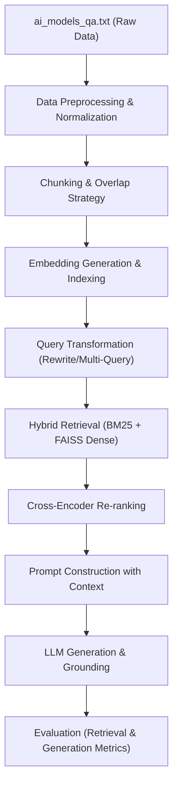

# ⚡ LAB05: RAG System Development II & Common Failure Modes Analysis

ระบบวิเคราะห์และจำลอง 9+ ปัญหาสำคัญในการพัฒนาระบบ **RAG (Retrieval-Augmented Generation)** และ **LLM** ด้วยชุดข้อมูลจริง

---

### 👨‍💻 สมาชิกผู้จัดทำ (Author)
* **ชื่อ-นามสกุล (Name):** นายรัชชานนท์ ศรีไชย
* **รหัสนักศึกษา (Student ID):** 116730462005-3

---

## 📖 บทนำและวัตถุประสงค์ (Overview & Objectives)

โปรเจกต์นี้เป็นการศึกษาและทดลองเชิงลึกเกี่ยวกับ **ข้อผิดพลาดและจุดคอขวด (Failure Modes & Bottlenecks)** ที่พบบ่อยในการพัฒนาและปรับแต่งระบบ RAG ให้มีประสิทธิภาพสูง โดยใช้ชุดข้อมูลคลังความรู้จริงคือ `ai_models_qa.txt` (ชุดข้อมูลถาม-ตอบโมเดล AI ในปัจจุบัน) เพื่อทดสอบ วิเคราะห์ และหาวิธีรับมือกับปัญหาที่เกิดขึ้นในแต่ละส่วนของ Pipeline



---

## 📁 โครงสร้างโปรเจกต์ (Project Structure)

```text
LAB05/
├── README.md                      # 📄 รายงานสรุปและคู่มือการวิเคราะห์ปัญหา RAG
├── ai_models_qa.txt               # 📚 คลังข้อมูลความรู้จริง (AI Models Q&A Knowledge Base)
├── data_loader.py                 # 🔄 ตัวโหลดและแปลงข้อมูล ai_models_qa.txt -> list of dict
├── main.py                        # 💻 สคริปต์เมนูหลักสำหรับเลือกรันและทดสอบแต่ละปัญหา
├── problem01_hallucination.py     # 🛑 ปัญหาที่ 1: ภาพหลอน (Hallucination / ตอบโดยไร้ Supporting Context)
├── problem02_transformer.py       # 🔤 ปัญหาที่ 2: คำไม่ตรงกัน (Vocabulary Mismatch) + Token Position
├── problem03_data_quality.py      # 🧹 ปัญหาที่ 3: คุณภาพข้อมูล (Duplicate / Noise / Text Normalization)
├── problem04_chunking.py          # ✂️ ปัญหาที่ 4: การหั่นข้อความ (Chunk Size เล็ก/ใหญ่เกินไป & Overlap)
├── problem05_metadata.py          # 🏷️ ปัญหาที่ 5: การกรองด้วยข้อมูลกำกับ (Metadata Filtering)
├── problem06_reranking.py         # 🎯 ปัญหาที่ 6: การจัดอันดับและเลือก (Top-k Selection & Re-ranking)
├── problem07_generation.py        # ⚠️ ปัญหาที่ 7: ค้นหาเอกสารเจอถูก แต่ LLM สร้างคำตอบผิดพลาด
├── problem08_config.py            # ⚙️ ปัญหาที่ 8: การปรับแต่งค่าคอนฟิก (RAG Configuration Impact)
└── problem09_evaluation.py        # 📊 ปัญหาที่ 9: การประเมินและวัดผลระบบ RAG (Evaluation Metrics)
```

---

## 🔬 รายละเอียด 9 ปัญหาสำคัญในการพัฒนาระบบ RAG (Detailed Problem Breakdown)

### 1. Problem 01: Hallucination & Context Deficiency (ภาพหลอนและการขาด Context)
* **สาเหตุ:** LLM ถูกถามคำถามเฉพาะทาง แต่ระบบค้นหาไม่พบ Context หรือ Context ที่ส่งไปไม่ครอบคลุม ทำให้ LLM พยายามสร้างคำตอบขึ้นมาเองจากความจำภายในโมเดล (Parametric Memory Hallucination)
* **การทดสอบ:** เปรียบเทียบคำตอบของ LLM ระหว่างการถามแบบไม่มี Context จาก `ai_models_qa.txt` กับการใส่ Context ที่ค้นหาได้
* **แนวทางแก้ไข:** กำหนด System Prompt และ Guardrails ให้ตอบเฉพาะข้อมูลที่มีใน Context เท่านั้น หากไม่พบข้อมูลให้ตอบข้อความปฏิเสธอย่างชัดเจน เช่น `"ขออภัย ไม่พบข้อมูลที่เกี่ยวข้อง"`

---

### 2. Problem 02: Vocabulary Mismatch & Token Position (ปัญหาคำไม่ตรงกันและตำแหน่ง Token)
* **สาเหตุ:**
  * **Vocabulary Mismatch:** ผู้ใช้ใช้คำค้นหาคนละคำกับที่ปรากฏในเอกสาร (เช่น "ความเร็ว" vs "Latency", "ค่าบริการ" vs "Pricing")
  * **Lost in the Middle:** โมเดลตระกูล Transformer มักให้ความสำคัญกับข้อมูลที่อยู่ตอนต้นและตอนท้ายของ Prompt มากกว่าข้อมูลที่อยู่ตรงกลาง
* **การทดสอบ:** ทดสอบผลลัพธ์การค้นหาระหว่าง Keyword Search (BM25) กับ Semantic Search (Vector Embedding) และทดสอบสลับตำแหน่งของ Chunk สำคัญใน Context
* **แนวทางแก้ไข:** ใช้ Hybrid Retrieval ผสมผสาน BM25 + Vector Search และใช้ Query Expansion / Rewrite เพื่อขยายคำค้นหา

---

### 3. Problem 03: Data Quality, Noise & Redundancy (คุณภาพข้อมูล ความซ้ำซ้อน และสัญญาณรบกวน)
* **สาเหตุ:** ข้อมูลดิบใน `ai_models_qa.txt` อาจมีข้อความซ้ำซ้อน (Duplicate), มีอักขระพิเศษขยะ, สระลอย หรือการเว้นวรรคภาษาไทยที่ไม่เป็นมาตรฐาน ทำให้เวกเตอร์ Embedding บิดเบือน
* **การทดสอบ:** วิเคราะห์ผลกระทบของข้อมูลขยะต่อค่า Cosine Similarity และการดึงข้อมูลผิดพลาด
* **แนวทางแก้ไข:** ทำ Text Cleaning, Text Normalization (เช่น ใช้ PyThaiNLP ทำ `normalize`) และตัดข้อมูลซ้ำซ้อน (Deduplication) ก่อนนำเข้า Vector Store

---

### 4. Problem 04: Chunking Strategy - Size & Overlap (ขนาด Chunk และการทับซ้อน)
* **สาเหตุ:**
  * **Chunk เล็กเกินไป:** ใจความขาดตอน ขาดบริบทแวดล้อม ทำให้ LLM ตีความผิด
  * **Chunk ใหญ่เกินไป:** มี Noise ปะปนมากเกินไป และเปลือง Token Context Window
  * **ไม่มี Chunk Overlap:** ข้อมูลตรงรอยต่อของประโยคถูกตัดขาดออกจากกัน
* **การทดสอบ:** เปรียบเทียบประสิทธิภาพการดึงข้อมูลด้วย Chunk Size ต่างๆ (เช่น 100, 400, 1000 ตัวอักษร) ร่วมกับค่า Overlap ต่างๆ
* **แนวทางแก้ไข:** กำหนด Chunk Size ให้เหมาะสมกับลักษณะเอกสาร (เช่น 300–500 ตัวอักษร) พร้อม Overlap ประมาณ 10–15%

---

### 5. Problem 05: Metadata Filtering (การคัดกรองด้วยข้อมูลกำกับ)
* **สาเหตุ:** ค้นหาเจอ Chunk ที่มีเนื้อหาคล้ายกันแต่เป็นคนละหมวดหมู่หรือคนละบริบท (เช่น ถามเรื่องราคา แต่ผลลัพธ์ดึงหมวดภาพรวมโมเดลมา)
* **การทดสอบ:** เปรียบเทียบการค้นหาแบบไม่กรอง Metadata กับการทำ Pre-filtering และ Post-filtering โดยใช้หัวข้อ `[หมวด: ...]` จาก `ai_models_qa.txt`
* **แนวทางแก้ไข:** แนบ Metadata ไปกับทุก Chunk เพื่อให้สามารถทำ Attribute/Category Filtering ร่วมกับการค้นหาเชิงความหมายได้

---

### 6. Problem 06: Top-K Selection & Cross-Encoder Re-ranking (การเลือก Top-K และการจัดอันดับใหม่)
* **สาเหตุ:** Vector Search ทั่วไป (Bi-encoder) คำนวณเวกเตอร์ของคำถามและเอกสารแยกกัน ทำให้บางครั้งเอกสารที่มีความสอดคล้องสูงสุดไม่ได้อยู่ในอันดับต้นๆ (Top-K)
* **การทดสอบ:** ดึง Candidate ออกมาจำนวนมาก (เช่น `CANDIDATE_K = 20`) แล้วส่งเข้า Cross-Encoder Reranker (`BAAI/bge-reranker-v2-m3`) เพื่อจัดอันดับใหม่ก่อนคัดเหลือ `TOP_K = 3`
* **แนวทางแก้ไข:** ใช้สถาปัตยกรรม Two-Stage Retrieval (First-stage: Fast Hybrid Search -> Second-stage: Deep Cross-Encoder Reranking)

---

### 7. Problem 07: Generation Failure despite Correct Retrieval (ค้นหาเจอถูกแต่สร้างคำตอบผิด)
* **สาเหตุ:** ระบบค้นหา Chunk ที่มีคำตอบถูกต้องมาได้แล้ว แต่ LLM ตอบผิดเนื่องจาก Prompt กำกวม, Context ยาวและซับซ้อนเกินไป, หรือตั้งค่า Temperature สูงเกินไป
* **การทดสอบ:** ทดสอบ Prompt Templates ในรูปแบบต่างๆ และปรับค่า `LLM_TEMPERATURE` (0.0 ถึง 0.8) เพื่อสังเกตคุณภาพการตอบ
* **แนวทางแก้ไข:** ปรับปรุง System Prompt ให้มีคำสั่งที่ชัดเจน (Clear & Explicit Constraints) และปรับค่า Temperature ต่ำ (0.0 - 0.2) สำหรับงาน Q&A เชิงข้อเท็จจริง

---

### 8. Problem 08: RAG Configuration & Hyperparameters (การปรับแต่งค่าคอนฟิกของระบบ)
* **สาเหตุ:** การตั้งค่าพารามิเตอร์ของระบบ RAG ส่งผลโดยตรงต่อความเร็ว ความแม่นยำ และค่าใช้จ่าย
* **พารามิเตอร์สำคัญที่ต้องปรับจูน:**
  * `CHUNK_SIZE` / `CHUNK_OVERLAP`
  * `TOP_K` / `CANDIDATE_K` / `RRF_K`
  * `EMBEDDING_MODEL_NAME` (เช่น `BAAI/bge-m3`)
  * `LLM_PROVIDER` / `LLM_TEMPERATURE` / `LLM_MAX_TOKENS`
  * สวิตช์ฟังก์ชัน: `USE_HYBRID`, `USE_RERANK`, `USE_QUERY_TRANSFORM`, `USE_MEMORY`, `USE_LLM`

---

### 9. Problem 09: RAG Evaluation Suite (การประเมินและวัดผลระบบ RAG)
* **การประเมินส่วน Retrieval (Retrieval Metrics):**
  * **Hit Rate @ K:** สัดส่วนที่ Chunk คำตอบที่ถูกต้องติดอยู่ใน Top-K
  * **MRR (Mean Reciprocal Rank):** ลำดับส่วนกลับเฉลี่ยของ Chunk ที่ถูกต้อง
  * **NDCG (Normalized Discounted Cumulative Gain):** คุณภาพการเรียงลำดับความเกี่ยวข้องของเอกสาร
* **การประเมินส่วน Generation (Generation Metrics):**
  * **Faithfulness / Groundedness:** คำตอบอ้างอิงจาก Context จริง ไม่มีการแต่งเติมเอง
  * **Answer Relevancy:** คำตอบตอบตรงกับคำถามของผู้ใช้
  * **ROUGE-1, ROUGE-2, ROUGE-L & BLEU:** ความแม่นยำของคำตอบเมื่อเทียบกับ Golden Answer

---

## 🚀 วิธีการติดตั้งและทดสอบ (Getting Started)

### 1. ติดตั้ง Dependencies ที่จำเป็น
```powershell
pip install pythainlp sentence-transformers faiss-cpu rank-bm25 openai
```

### 2. รันสคริปต์ทดสอบ
```powershell
# เปิดเมนูหลักเพื่อเลือกทดสอบแต่ละปัญหา
python main.py

# หรือระบุหมายเลขปัญหาที่ต้องการทดสอบทันที (ตัวอย่าง: ปัญหาที่ 6 Reranking)
python main.py 6
```

---

## 📝 สรุปผลการทดลอง (Conclusion & Insights)
1. **การจัดการคุณภาพข้อมูลและการหั่น Chunk (Data Quality & Chunking):** เป็นรากฐานที่สำคัญที่สุด หาก Chunking ผิดพลาด ระบบค้นหาและ LLM จะไม่สามารถทำงานได้อย่างสมบูรณ์
2. **Hybrid Search + Cross-Encoder Reranking:** ให้ความแม่นยำสูงกว่า Vector Search เดี่ยวๆ อย่างมีนัยสำคัญ โดยเฉพาะกับคำค้นหาที่เป็นชื่อเฉพาะหรือศัพท์เทคนิค AI
3. **การควบคุม Prompt และ Temperature:** เป็นหัวใจสำคัญในการป้องกันการเกิด Hallucination ของโมเดล LLM ในขั้นตอนการสร้างคำตอบ
