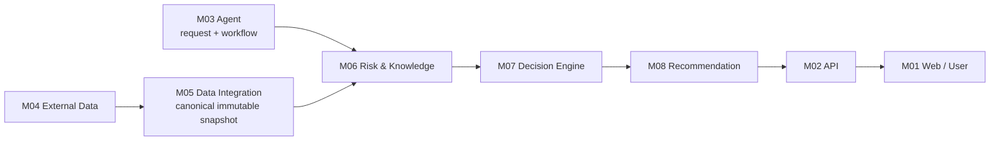

# LAB07: Module 06 — Risk & Knowledge Services

> **Status: ✅ Complete (implementation and verification completed)**

**รายวิชา:** Advanced Topic in Computer Software (ATCS-CPE)  
**โปรเจกต์หลัก:** [Smart Travel Assistant](https://github.com/PROxTAE/travel-safety-ai)  
**ผู้จัดทำ:** นายรัชชานนท์ ศรีไชย (`116730462005-3`) — GitHub [@Nonyeol](https://github.com/Nonyeol)
**ผู้รับผิดชอบ:** Nonyeol — Module 06 Engineer  
**Git subtree source:** `services/risk-knowledge/`

## 1. บทบาทของ Module 06

Module 06 เป็นชั้นวิเคราะห์ความเสี่ยงและหลักฐานของ Smart Travel Assistant โดยรับ `IntegratedTravelContext` ซึ่ง Module 05 รวมจากข้อมูลภายนอกให้เป็น canonical immutable snapshot แล้วทำงาน 4 ส่วน: ประเมินความเสี่ยงของ route, ค้นหลักฐานจากเอกสารที่ได้รับอนุมัติ, ตรวจ exposure/closure/ข้อจำกัดของ route และรวมผลเป็น Evidence Package ให้ Module 07 ตัดสินใจต่อ

M06 ไม่ได้ดึง provider โดยตรง ไม่ได้ตัดสินใจแทน M07 และไม่ได้สร้างข้อความสุดท้ายให้ผู้ใช้ โดย M08 เรียบเรียงคำแนะนำผ่าน M02 ไปยัง M01

## 2. Cross-module data flow

## 3. Input → Processing → Output

### Input

- `IntegratedTravelContext`: snapshot, request/trip identity, travel window และ timezone
- route candidates และ route geometry
- weather, transport, disaster events และ official alerts
- features, quality summary, conflict summary, provenance และ versions
- approved model/policy/knowledge metadata เมื่อพร้อมใช้งาน

### Processing

- ตรวจ authentication, schema/version, route membership และคุณภาพข้อมูล
- สร้าง route features จากระยะทาง เวลา weather hazard exposure transport และ official alerts
- ใช้ calibrated baseline model และ rule baseline ประเมินความเสี่ยง
- ใช้ official safety overrides และ hard constraints เช่น closure/evacuation/no-go
- ค้นเอกสารด้วย hybrid BM25 + vector retrieval พร้อม region/language/expiry filters
- ตรวจ route corridor กับช่วงเวลาเดินทางและจัดอันดับแบบ deterministic เมื่อ policy coefficients พร้อม
- รวม Risk, Knowledge และ Routes เป็น Evidence Package

### Output

- `RiskAssessment[]`: risk level, score/probability, uncertainty, reason codes และ model metadata
- `RetrievedEvidence[]`: passage, authority, source URL, page/section, freshness และ citation
- ranked/removed routes พร้อมข้อจำกัดและเหตุผล
- quality, provenance, limitations และ version evidence
- `UNKNOWN`, `PARTIAL` หรือ `DEGRADED` เมื่อข้อมูลหรือ capability ไม่พร้อม

## 4. Phase ที่ดำเนินการ

| Phase | สิ่งที่ทำ |
|---|---|
| 0 | contracts, feature schema, null/UNKNOWN policy และ governance |
| 1 | FastAPI, auth, PostgreSQL, Qdrant, MLflow, telemetry และ fail-closed fallback |
| 2 | real historical dataset, lineage, labeling, time/geographic split, bias audit และ manifest |
| 3 | rule/calibrated baseline, leakage-safe CV, metrics, threshold analysis, model card และ checksum |
| 4 | safety override, monotonic tests, drift/recall monitoring และ rollback |
| 5 | approved-source ingestion, chunking, hybrid retrieval, citations, expiry และ collection rollback |
| 6 | route exposure, hard constraints, deterministic ranking และ reason codes |
| 7 | risk/knowledge/routes APIs และ concurrent Evidence Package พร้อม degraded semantics |
| 8 | golden cases, citation/route safety, resource/rollback evidence และ completion report |

## 5. ผลการตรวจสอบ

- Phase 0–2 merge เข้า `main` แล้ว
- Phase 3–8 implementation อยู่ใน [PR #93](https://github.com/PROxTAE/travel-safety-ai/pull/93) และจัดทำรายงานครบตามขอบเขตของ Module 06
- `87 tests passed`, coverage `83.51%`
- Ruff lint/format, Mypy, Compose และ security checks ผ่านตามรายงาน M06

## 6. หลักการด้านความปลอดภัย

- ข้อมูลไม่ครบไม่ถูกตีความว่า “ปลอดภัย”
- missing critical evidence คงเป็น `UNKNOWN` ไม่แปลงเป็น `false`, `LOW` หรือ zero
- official warning, closure และ evacuation มี priority สูงกว่าผลโมเดล
- โมเดลที่ไม่มี checksum/signature/approval จะไม่ถูกเลื่อนเป็น `ACTIVE`
- route ที่ติด hard constraint จะไม่ถูกแนะนำ แม้โมเดลจะให้คะแนนต่ำ
- M06 วิเคราะห์และจัดหลักฐาน, M07 ตัดสินใจ, M08 สื่อสารกับผู้ใช้

## 7. สถานะและงานที่ยังรอ

โค้ดและ automated verification พร้อมสำหรับ review แต่ production activation ยังรอ Team Lead approval สำหรับ model thresholds/signature, approved knowledge corpus/encoder, approved numeric route coefficients และ live-provider acceptance evidence

## 8. เอกสารอ้างอิง

- [M06 implementation plan](https://github.com/PROxTAE/travel-safety-ai/blob/main/IMPLEMENTATION_PLANS/06_RISK_KNOWLEDGE_SERVICES_IMPLEMENTATION.md)
- [M06 Phase 3–8 report](services/risk-knowledge/PHASES_3_8_REPORT.md)
- [M06 PR #93](https://github.com/PROxTAE/travel-safety-ai/pull/93)
