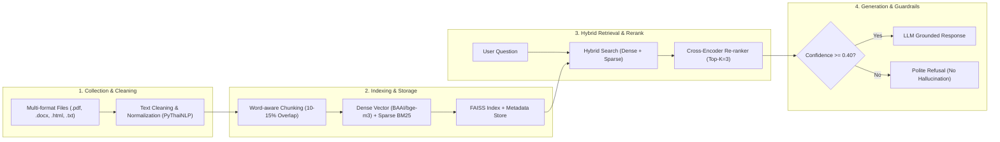

<div align="center">

# 🚀 ATCS-CPE: Advanced Topics in Computer Software
### 📚 คลังรวบรวมแบบฝึกหัดปฏิบัติการและโครงงานวิชาหัวข้อขั้นสูงทางซอฟต์แวร์คอมพิวเตอร์
**Computer Engineering (CPE) • Rajamangala University of Technology Thanyaburi (RMUTT)**

---

[](https://www.python.org/)
[](https://pytorch.org/)
[](https://huggingface.co/)
[](https://github.com/facebookresearch/faiss)
[](https://www.docker.com/)
[](LICENSE)

</div>

---

## 👨‍💻 ข้อมูลนักศึกษา (Student Profile)

<div align="center">

| ข้อมูล (Detail) | รายละเอียด (Description) |
| :--- | :--- |
| **👤 ชื่อ-นามสกุล (Name)** | **นายรัชชานนท์ ศรีไชย (Mr. Ratchanon Srichai)** |
| **🆔 รหัสนักศึกษา (Student ID)** | `116730462005-3` |
| **🏫 สาขาวิชา (Department)** | วิศวกรรมคอมพิวเตอร์ (Computer Engineering - CPE) |
| **📘 รายวิชา (Course)** | Advanced Topics in Computer Software (ATCS) |
| **🐙 GitHub Account** | [@Nonyeol](https://github.com/Nonyeol) |
| **📁 Repository** | [Nonyeol/ATCS-CPE](https://github.com/Nonyeol/ATCS-CPE) |

</div>

---

## 📊 สรุปความคืบหน้าภาพรวม (Progress Overview Dashboard)

```text
Progress : [████████████████░░░░░░░░░░░░] 55% Completed
Completed: LAB01, LAB04, LAB05, Data Pipeline Project
Ongoing  : LAB02, LAB03, Final-Project
Upcoming : LAB06 - LAB10 (Agentic AI Series)
```

---

## 📋 แดชบอร์ดสรุปงานปฏิบัติการและโครงงาน (Labs & Projects Dashboard)

| รายการ (Task / Module) | หัวข้อการเรียนรู้ (Topic & Domain) | เทคโนโลยีหลัก (Key Technologies) | สถานะ (Status) | ลิงก์โฟลเดอร์ (Directory) |
| :---: | :--- | :--- | :---: | :---: |
| **LAB01** | **RAG Foundations & Web Retrieval**<br>การสร้างระบบ RAG เบื้องต้น, แปลงข้อความเป็น Embedding และค้นหาคำตอบผ่าน FAISS พร้อม Web UI | `Sentence-Transformers`, `FAISS`, `Flask`, `Python` |  | [📂 `LAB01/`](./LAB01/) |
| **LAB02** | **LLM Data Processing**<br>การเตรียมความพร้อมและประมวลผลชุดข้อมูลสำหรับโมเดลภาษาขนาดใหญ่ | `Data Preprocessing`, `Text Cleansing` |  | [📂 `LAB02/`](./LAB02/) |
| **LAB03** | **LLM Retrieval System**<br>ระบบการค้นคืนข้อมูลเชิงความหมายและการจัดทำดัชนีเวกเตอร์ | `Vector Indexing`, `Similarity Search` |  | [📂 `LAB03/`](./LAB03/) |
| **LAB04** | **AI Models Q&A System (Production RAG)**<br>สถาปัตยกรรม Hybrid Search (FAISS + BM25), BGE-M3 Embedding, Reranking, Evaluation Suite และ Dockerized App | `BAAI/bge-m3`, `BM25`, `FAISS`, `Docker`, `Flask` |  | [📂 `LAB04/`](./LAB04/) |
| **LAB05** | **RAG Failure Modes Analysis & Optimization**<br>การจำลองและแก้ไข 9 ปัญหาคอขวด RAG: Hallucination, Chunking, Word-aware Slicing, Metadata, Reranking และ Hit Rate@K Benchmark | `PyThaiNLP`, `Cross-Encoder`, `Evaluation (MRR/Hit@K)` |  | [📂 `LAB05/`](./LAB05/) |
| **LAB06** | **RAG Application System**<br>การพัฒนาระบบแอปพลิเคชัน RAG สู่การประยุกต์ใช้งานจริงในองค์กร | `Fullstack RAG`, `API Integration` |  | [📂 `LAB06/`](./LAB06/) |
| **LAB07** | **Agentic AI I**<br>ระบบเอเจนต์อัจฉริยะ การวางแผนและการเรียกใช้เครื่องมือ (Tool Calling & Function Calling) | `AI Agents`, `Function Calling`, `LLM Chains` |  | [📂 `LAB07/`](./LAB07/) |
| **LAB08** | **Agentic AI II**<br>การทำงานร่วมกันของหลายเอเจนต์ (Multi-Agent Collaboration & Orchestration) | `Multi-Agent`, `LangGraph / CrewAI` |  | [📂 `LAB08/`](./LAB08/) |
| **LAB09** | **Agentic AI III**<br>ระบบเอเจนต์ทำงานอิสระ หน่วยความจำระยะยาว และ Guardrails เชิงลึก | `Autonomous Agents`, `Memory Systems` |  | [📂 `LAB09/`](./LAB09/) |
| **LAB10** | **Advanced Topics & Systems Optimization**<br>การปรับแต่งประสิทธิภาพขั้นสูง การประเมินผลและการสเกลระบบ | `Optimization`, `Load Testing`, `Monitoring` |  | [📂 `LAB10/`](./LAB10/) |
| **Pipeline Project** | **LLM Data Pipeline (Person 1 Responsibility)**<br>ระบบ Pipeline รวบรวมข้อมูลหลากฟอร์แมต (PDF, Docx, HTML, TXT, MD) และทำ Data Cleaning กรองขยะตาม Pydantic Data Contract | `Pydantic v2`, `PyPDF`, `BeautifulSoup4`, `PyTest` |  | [📂 `My-Pipeline.../`](./My-Pipelineproject-collection-cleaning/) |
| **Final Project** | **ATCS Capstone Final Project**<br>โครงงานโครงงานวิชาหัวข้อขั้นสูงทางซอฟต์แวร์คอมพิวเตอร์ | `End-to-End LLM/RAG/Agent Project` |  | [📂 `Final-Project/`](./Final-Project/) |

---

## 🛠️ ไฮไลท์ผลงานสำคัญ (Key Milestone Highlights)



### 1. ⚡ LAB04: AI Models Question Answering System
* **สถาปัตยกรรม:** Hybrid Retrieval ผสมผสาน **Dense Semantic Search (FAISS + BGE-M3)** และ **Sparse Keyword Search (BM25)**
* **Web UI & CLI:** รองรับการตั้งค่า Dynamic Parameters, ปรับน้ำหนัก Alpha, เลือกรุ่นโมเดล และทดสอบแบบ Interactive
* **Containerization:** รองรับการติดตั้งแบบ **Docker Containerized Deployment** เพียงสั่งรันคำสั่งเดียว
* **การประเมินผล:** มีชุดทดสอบ Benchmark วัดค่า Mean Reciprocal Rank (MRR) และ Hit Rate@K

### 2. 🔬 LAB05: RAG Common Failure Modes Analysis (9 Scenarios)
วิเคราะห์จุดบกพร่องของระบบ RAG จาก LAB04 และพัฒนาโมดูลแก้ไข 9 ด้านอย่างเป็นระบบ:
1. **Hallucination Prevention:** กำหนด Similarity Threshold สกัดกั้นคำถาม Out-of-Domain
2. **Vocabulary Mismatch & Lost in the Middle:** นำ Query Rewrite มาประยุกต์และปรับลำดับ Context
3. **Data Quality & Normalization:** ขจัดสระลอย วรรณยุกต์ซ้อน และ Hash Deduplication ป้องกันข้อมูลซ้ำ
4. **Word-aware Chunking:** แก้ปัญหาตัดคำไทยขาดครึ่งท่อนด้วย PyThaiNLP
5. **Metadata Filtering:** รองรับการค้นหากรองเฉพาะหมวดหมู่ (Category Filtering)
6. **Two-Stage Re-ranking:** ใช้ Cross-Encoder (`bge-reranker-v2-m3`) เพิ่ม **Hit Rate @ 3 ขึ้นเป็น 100%**
7. **Faithfulness & Grounded Generation:** กำหนด Temperature ต่ำและ System Guardrails ป้องกันข้อมูลตัวเลขผิดเพี้ยน
8. **Index Desynchronization Drift:** ระบบตรวจจับการเปลี่ยนแปลง Config กับ Vector Index อัตโนมัติ
9. **Evaluation Suite:** ระบบวัดผลเชิงปริมาณอัตโนมัติ (Hit Rate@1, 3, 5, 10 และ MRR)

### 3. 📦 LLM Data Pipeline Project (Person 1: Collection & Cleaning)
* **Step 1 (Collection):** คลาส `Collector` ดึงข้อมูลจากไฟล์ `.pdf`, `.docx`, `.html`, `.txt`, `.md` พร้อม File Integrity Checks และ Logging ระดับมืออาชีพ
* **Step 2 (Cleaning):** คลาส `Cleaner` ทำ Multi-format parsing, ขจัด Page Numbers, Whitespaces และกรอง HTML boilerplates
* **Data Contracts:** สื่อสารข้อมูลระหว่างขั้นตอนอย่างมีมาตรฐานด้วย `Pydantic v2` (`CollectionOutput`, `CleaningOutput`)
* **Testing:** ครอบคลุม Unit Tests ด้วย `pytest`

---

## 🚀 วิธีการทดสอบและรันโปรเจกต์ (Quick Start)

### ตัวเลือกที่ 1: รัน LAB04 RAG Web Application ผ่าน Docker (เร็วที่สุด)

```powershell
cd LAB04/04-RAG-Project
docker build -t atcs-lab04-rag:latest .
docker run -d -p 5000:5000 --name atcs-lab04-rag atcs-lab04-rag:latest
```
เปิดใช้งานผ่านเบราว์เซอร์ได้ที่: **http://localhost:5000**

---

### ตัวเลือกที่ 2: รัน LAB05 RAG Analysis Simulator

```powershell
cd LAB05
pip install pythainlp sentence-transformers faiss-cpu rank-bm25 openai
python main.py
```
*(สามารถเลือกทดสอบปัญหาข้อ 0-9 ผ่านเมนู Interactive ในเทอร์มินัล)*

---

### ตัวเลือกที่ 3: รัน LLM Data Pipeline (Collection & Cleaning)

```powershell
cd My-Pipelineproject-collection-cleaning
pip install -r requirements.txt
python run_pipeline.py all
```

---

## 📂 โครงสร้างไดเรกทอรีของคลังงาน (Repository Tree)

```text
ATCS-CPE/
├── README.md                                  # 📌 หน้ารวม Dashboard โครงการและข้อมูลผู้จัดทำ (หน้านี้)
├── Final-Project/                             # 🚀 โครงงานปลายภาค (Course Capstone Project)
├── LAB01/                                     # 💻 RAG Lab พื้นฐาน (Embedding + FAISS + Web UI)
├── LAB02/                                     # 💻 LLM Data Processing
├── LAB03/                                     # 💻 LLM Retrieval System
├── LAB04/                                     # 💻 AI Models Q&A System (Production RAG & Docker)
│   └── 04-RAG-Project/                        # 🐳 โฟลเดอร์ระบบ RAG ฉบับเต็ม (Web UI, Evaluation, Docker)
├── LAB05/                                     # 🔬 วิเคราะห์ 9 ปัญหาและจุดล้มเหลวของระบบ RAG (Failure Modes)
├── LAB06/                                     # 💻 RAG Application System (Upcoming)
├── LAB07/                                     # 🤖 Agentic AI I - Tool Calling (Upcoming)
├── LAB08/                                     # 🤖 Agentic AI II - Multi-Agent (Upcoming)
├── LAB09/                                     # 🤖 Agentic AI III - Autonomous Agents (Upcoming)
├── LAB10/                                     # 💻 Advanced Topics & Performance Tuning (Upcoming)
└── My-Pipelineproject-collection-cleaning/    # 🔄 LLM Data Pipeline (Person 1: Collection & Cleaning)
```

---

<div align="center">

**Department of Computer Engineering • Faculty of Engineering**  
**Rajamangala University of Technology Thanyaburi**  
*Maintained with ❤️ by [Ratchanon Srichai (@Nonyeol)](https://github.com/Nonyeol)*

</div>
